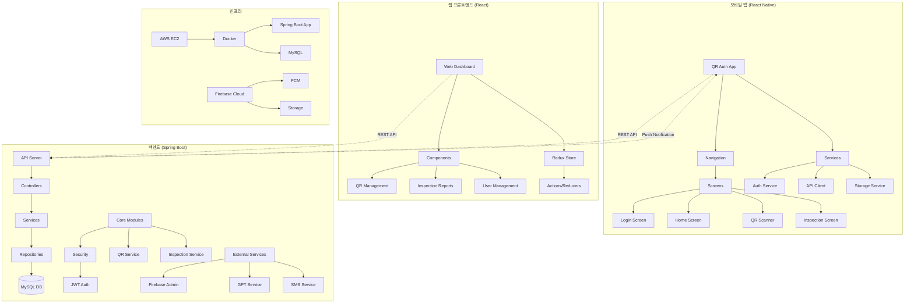

# Funniture
<br/>

<div align="flex-start"></div>
<br/>

**프로젝트 기간 : 2025.01.13 ~ 2025.03.17 (9주)**

<br/>

## ✨ 프로젝트 소개


## **프로젝트 : 🛋Funniture📺**

#### **개요**
공항 시설물의 효율적이고 체계적인 관리를 위한 종합 솔루션 제공 프로그램 개발. React.js를 이용한 SPA 애플리케이션과 Spring Boot 기반의 REST API 서버를 구축하고, 도커를 활용한 클라우드 배포를 통해 공항 내 시설물 관리와 대여를 지원합니다.

#### **주요 기능**
- **실시간 모니터링 및 소통**: 공항 내 비행기, 점포, 창고, 편의 시설, 안내소 등 다양한 시설물의 상태를 실시간으로 모니터링하고 필요한 소통 기능 제공.
- **QR 코드 활용**: 시설물에 부착된 QR 코드를 이용하여 장비 재고 관리 및 시설물 유지 보수 일정 관리.
- **실시간 알림**: 재고 부족, 유지 보수 필요 시 실시간 알림 기능 제공.
- **보고서 생성**: 재고 목록 표, 시설물 일일 점검 일지, 유지 보수 계획 보고서 자동 생성.

#### **목표**
- 공항 운영자가 시설물 상태를 한눈에 파악하고, 유지 보수 작업을 적시에 수행하여 불필요한 운영 중단 최소화.
- 공항의 효율적 운영과 안전성 확보를 통해 이용객들에게 더 나은 서비스 제공.


<br/>

### **아키텍처**



**프로젝트 문서**
 
| 📒 [팀 Notion ](https://adorable-entree-2a6.notion.site/HitechAutoWorks-746bb8d780ce4f07957e2efccb4a37d8?pvs=4](https://ohgiraffers.notion.site/SkyCare-e6c16dc3f41b4521948d685a14f4bd80?pvs=4)) | 🎉 [Figma](https://www.figma.com/design/ncnvZxnE8j2mM3fBtjmweC/%EC%8B%9C%EC%84%A4%EB%AC%BC-%EA%B4%80%EB%A6%AC--%EC%95%88%EB%82%B4%EC%86%8C-%EC%A1%B0%ED%9A%8C?node-id=0-1&m=dev&t=R1QnTV1cniEE8Ti2-1) | 💌 [Miro](https://miro.com/welcomeonboard/RjlzeXZuME9qMnBxY25LTkU4a1JEMWgxTHZhbjFqU1lidU53c3JNckQwTGtzajZtNzhKT0ZldURJYVFoZEhiVnwzNDU4NzY0NTg3Mjk1NzY0MjI4fDI=?share_link_id=888080450545)
<br/>
<br/>
<br/>

## 📅 프로젝트 일정

<br/>
<br/>
<br/>


***

## 🖥 기술 스택

## 📘 Front end

| 구분                 | 사용 기술 및 라이브러리          |
| -------------------- | ------------------------------- |
| 언어                 | JavaScript, HTML/CSS            |
| UI                   | Material-UI, Bootstrap, Styled Components, React Beautiful DnD, React Select, React Simple Tree Menu, React Bootstrap Table, React Chat Elements |
| 상태 관리            | Redux, React-Redux, @reduxjs/toolkit |
| 폼 및 유효성 검사    | Formik, React Hook Form, Yup, React Validation |
| 차트 및 시각화       | Chart.js, React Chartjs 2, ApexCharts, React ApexCharts, React Jvectormap |
| 에디터 및 리치 텍스트 | Draft.js, React Draft WYSIWYG, React Markdown, @uiw/react-md-editor |
| HTTP 통신            | Axios, Axios Mock Adapter        |
| 파일 처리            | HTML2Canvas, JSPDF, JS Cookie    |
| 유틸리티             | Moment.js, Chroma.js, UUID, Namor, Get Orientation, QRCode.react |
| 권한 관리            | @casl/ability, @casl/react       |
| 개발 도구 및 빌드    | Vite, ESLint, @vitejs/plugin-react |

***


## 📙 Back end

| 구분                 | 사용 기술 및 라이브러리          |
| -------------------- | ------------------------------- |
| 언어                 | Java (JDK 17)                   |
| 프레임워크           | Spring Boot, Spring Security, Spring Web, Spring Data JPA, Spring WebSocket, Spring Validation, Spring Boot DevTools |
| 데이터베이스         | MySQL, MySQL Connector/J , Firebase       |
| API, 라이브러리      | ModelMapper, Commons IO, Unirest, jjwt (JSON Web Token), Dotenv (환경변수 관리) |
| 테스트               | JUnit, Spring Security Test, Spring Boot Test, JUnit Platform Launcher |
| 문서화               | Springdoc OpenAPI (Swagger)     |
| 메시징 및 알림       | Nurigo SMS SDK                  |
| 웹 클라이언트        | Spring WebFlux, WebClient       |
| 클라우드             | Firebase Admin SDK              |
| 어노테이션 프로세싱  | Lombok, Annotation Processor    |

***

## 📱 Mobile Application

| 구분                 | 사용 기술 및 라이브러리          |
| -------------------- | ------------------------------- |
| 언어                 | JavaScript                      |
| 모바일 애플리케이션 개발 | React Native, Expo              |
| 네비게이션           | React Navigation                |
| 상태 관리            | Formik, Yup                     |
| 네트워크 통신        | Axios                           |
| 스토리지             | @react-native-async-storage/async-storage |
| UI 컴포넌트          | @react-native-community/checkbox, @react-native-picker/picker, Expo Checkbox, React Native Safe Area Context, React Native Screens |
| 기기 기능            | Expo Barcode Scanner, Expo Camera |
| 웹뷰                 | React Native WebView            |
| 빌드 도구            | Babel                           |


***
***

## 🗂 디렉토리 구조

## 📘 front end

```
├── package-lock.json
├── package.json
├── public
│   ├── 1.png
│   ├── "etc..."`
│   └── music
│       └── miruni.mp3
├── src
│   ├── App.jsx
│   ├── assets
│   │   ├── images
│   │   └── scss
│   ├── components
│   │   ├── ComponentCard.js
│   │   ├── apps
│   │   ├── dashboard
│   │   ├── `"etc..."`
│   ├── firebase.js
│   ├── layouts
│   │   ├── BlankLayout.js
│   │   ├── FullLayout.js
│   │   ├── "etc..."`
│   ├── main.jsx
│   ├── routes
│   │   └── Router.js
│   ├── store
│   │   ├── Store.js
│   │   ├── apps
│   │   └── customizer
│   └── views
│       ├── airplane
│       ├── airportStore
│       ├── "etc..."`
└── vite.config.js
```
***

## 📙 back end
```
.
├── HELP.md
├── build
├── build.gradle
├── gradle
├── gradlew
├── gradlew.bat
├── settings.gradle
├── springreactfinal-firebase-adminsdk-e2c6d-238da92846.json
└── src
├── main
│   ├── java
│   │   └── com
│   │       └── finalproject
│   │           └── airport
│   │               ├── AirportApplication.java
│   │               ├── QRCode
│   │               ├── airplane
│   │               ├── approval
│   │               ├── "etc..."`

```
***

## 📱 Mobile Application

```
├── package-lock.json
├── package.json
├── assests
├── componetns
├── ├── qrscan
├── ├──└──QrScannerScreen.js
└── view
    ├── home
    │   └── HomeScreen.js
    ├── inspection
    │   └── InspectionRegist.js
    ├── login
    │   └── LoginScreen.js
    └── webview
        └── WebView.js
```
***

## ✨ 물리 데이터 모델


***


## ⭐️ 주요 기능

### 📌 회원가입

- 신규직원은 관리자에게 인증코드를 받아 회원가입을 할수 있습니다.
- 회원가입 시 권한/소속 등록 전은 프로필수정/채팅 등 기본적인 기능만 사용할 수 있습니다.

  

 <br/> 
 
  <details>
  <summary> 일반회원 / 회원가입 </summary>
  
  </details>
  
 <br/>


  <details>
  <summary> 일반회원 / 인증코드 수신(이메일/SMS) </summary>
 
 
  </details>
 
 <br/>   
 
 ***

 ### 📌 아이디 찾기 / 비밀번호 찾기

 - 아이디 찾기 시 이메일 요구 => 확인 성공시 아이디 표시
 - 비밀번호 찾기 시 등록된 이메일로 임시비밀번호 전송
     
 


 

<br/>

***


 ### 📌 프로필 내소개 / 이미지 등록

- 나의 프로필은 마크다운 + html 언어로 꾸밀 수 있습니다. 꾸민 프로필은 사원조회시 노출됩니다.
- 이미지를 원형으로 자를 수 있습니다. 

 
 
    
 <br/>   
 
***

 ### 📌 실시간 온라인 상태 확인

- 사원조회탭에서 실시간으로 온라인 상태를 확인 할 수 있습니다.
- 온라인인 유저에게 메시지를 전달 시 실시간으로 알림이 전송됩니다.

 
 

  - 😊[온라인 상태 Ping 확인 위키](https://github.com/finalprojectSinchon/backend/wiki/WebSocket-PingPong)

 <br/>   

 ***

  ### 📌 긴급 알림

- 공항에서 급박한 상황 발생시 로그인한 모든 유저에게 긴급한 알림을 발송합니다.

 


 <br/>   

 ***

 ### 📌 AI 검색

- AI 모델이 서버의 DB 를 조회해 사용자의 질문을 대답합니다.

 


 <br/>   

***

  ### 📌 QR 코드 인증 / AI 자동 문서화

- 직원은 각각의 시설물에 대해 정기정검을 시행할 수 있습니다.
- 시설물에 대한 정보를 간단히 입력하면 AI 가 보고서를 생성합니다.

 


 <br/>   

 ***

 ### 📌 매일 API 데이터 DB에 저장

 - 매일 자정 당일의 비행기 도착,출발 정보를 요청해 DB에 저장합니다.
 
   
 


<br/>

***

## 💡 WIKI

### 📙 Back end

  - 😊[GPT OPENAI 질문하기](https://github.com/finalprojectSinchon/backend/wiki/GPT-OPENAI-%EC%A7%88%EB%AC%B8%ED%95%98%EA%B8%B0)
  - 😊[join 되있는 엔티티 수정할 때 주의 할 점](https://github.com/finalprojectSinchon/backend/wiki/join-%EB%90%98%EC%9E%88%EB%8A%94-%EC%97%94%ED%8B%B0%ED%8B%B0-%EC%88%98%EC%A0%95%ED%95%A0-%EB%95%8C-%EC%A3%BC%EC%9D%98-%ED%95%A0-%EC%A0%90)
  - 😊[Lombok @Slf4j 사용법](https://github.com/finalprojectSinchon/backend/wiki/Lombok-@Slf4j-%EC%82%AC%EC%9A%A9%EB%B2%95)
  - 😊[온라인 상태 Ping 확인 위키](https://github.com/finalprojectSinchon/backend/wiki/WebSocket-PingPong)

 ### 📘 Front end
  - 😊[JWT 토큰 핸들](https://github.com/finalprojectSinchon/frontend/wiki/JWT-%ED%86%A0%ED%81%B0-%ED%95%B8%EB%93%A4)
  - 😊[로그인 검증 (프론트)](https://github.com/finalprojectSinchon/frontend/wiki/%EB%A1%9C%EA%B7%B8%EC%9D%B8-%EA%B2%80%EC%A6%9D-(%ED%94%84%EB%A1%A0%ED%8A%B8))
  - 😊[배포시 react 소스 코드 노출 막기](https://github.com/finalprojectSinchon/frontend/wiki/%EB%B0%B0%ED%8F%AC%EC%8B%9C-react-%EC%86%8C%EC%8A%A4-%EC%BD%94%EB%93%9C-%EB%85%B8%EC%B6%9C-%EB%A7%89%EA%B8%B0)
  - 😊[이미지 firebase 저장](https://github.com/finalprojectSinchon/frontend/wiki/%EC%9D%B4%EB%AF%B8%EC%A7%80-firebase-%EC%A0%80%EC%9E%A5)


<br/>
<br/>
